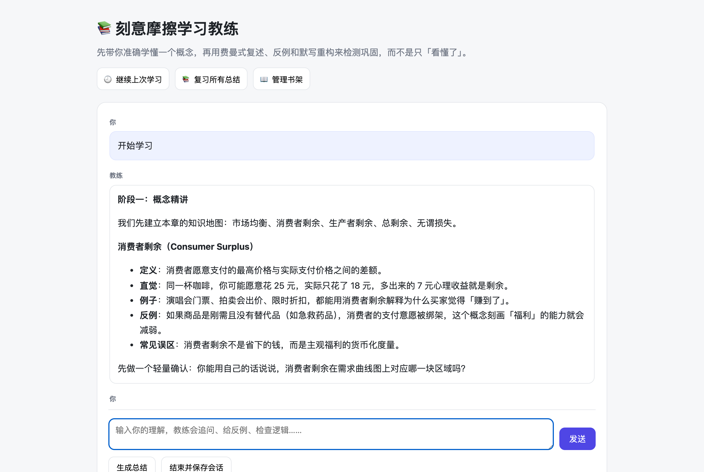
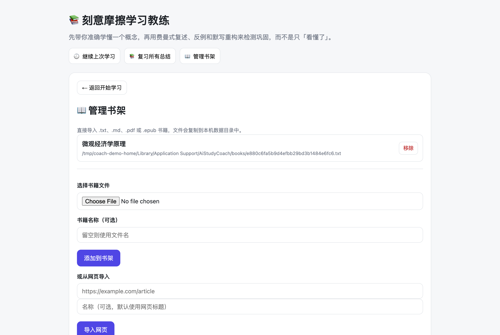
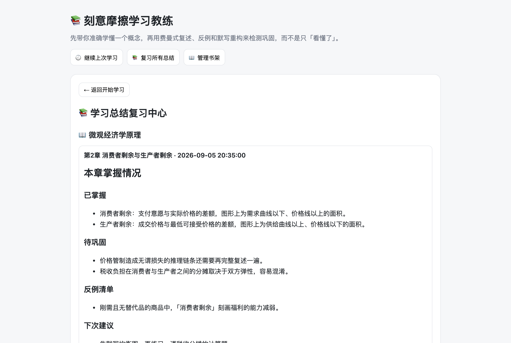
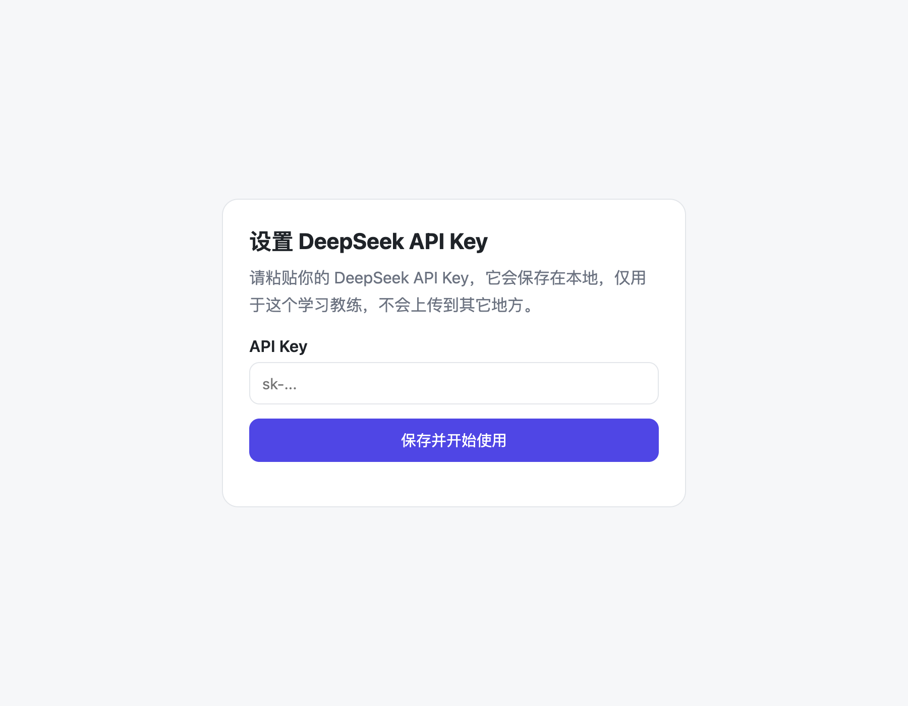

# AI-Study-Coach

**Teach first, test later.** A personal AI study coach that first guides you through accurate, source-based concept learning and then consolidates it with Feynman-style output practice — packaged as a desktop app, a mobile-friendly web app, and a cloud-deployable service, with bookshelf, long-term memory, and a unified review center.

[](https://www.python.org/)
[](#license)
[](https://www.deepseek.com/)
[](#installation-and-quick-start)

From Knowledge Anxiety to Building My Own AI Study Coach: A Pre-Freshman's Practice of "Deliberate Friction Learning"

In an era where AI technology evolves at a breakneck pace, knowledge anxiety haunts almost every learner. As a pre-freshman facing upcoming university courses, my biggest fear was falling into the trap of "I get it at a glance, but fail when I use it." To find a truly effective learning method, I started with the Feynman Technique, combined it with large language models, and step by step refined a methodology I call **"Deliberate Friction Learning."** Eventually, I built a private AI study coach program with persistent memory, strict step-by-step guidance, support for multiple books, and a usable interface for both desktop and mobile use.

This document is a complete record of the thinking, exploration, and implementation behind the project.

---

## Screenshots









---

## 1. The Starting Problem: How Do You Truly Learn a Concept in the Age of AI?

Traditional learning makes it easy to fall for the "illusion of learning" — you read the material, highlight key points, and mistakenly believe you have mastered them. Real understanding is built through a cycle of learning by teaching: learn, output, expose gaps, go back, and fix them.

The Feynman Technique was born for this, but its biggest pain point is not having a patient, available, and precise-questioning listener. AI solves this perfectly: zero emotional pressure, infinite patience, and the ability to play any role.

However, just treating AI as a passive Q&A tool is dangerous. If answers come too easily, we lose the ability to think deeply. What I needed was a method that, within the safety net of AI, deliberately creates cognitive friction — having the AI actively challenge me, probe boundaries, and provide counterexamples, forging my knowledge like quenching steel.

---

## 2. The Method Core: Deliberate Friction Learning

After much refinement, I settled on a two-phase loop that separates **accurate input** from **deep output**.

### Phase One: Guided First Pass (Concept Teaching)

Before any interrogation, the coach teaches the material accurately based on the source text:

1. Build a knowledge map of the chapter.
2. Explain each concept in order: definition → intuition → 2–3 examples → a counterexample or boundary condition → common misconceptions.
3. End each concept with a light comprehension check, letting me choose to continue, get another example, or hear it again.

### Phase Two: Feynman Consolidation (Testing)

Only after I confirm initial understanding does the coach switch to output-based practice:

1. **Recall & Explain** — close the book and explain the concept in plain language.
2. **Counterexamples & Boundaries** — the coach gives a counterexample and asks when the concept fails.
3. **Logic Visualization** — draw the reasoning chain and review it.
4. **Multi-Dimensional Collision** — examiner questioning, stuffed-animal explanation, and recording review.
5. **Reconstruction & Comparison** — rewrite from memory and compare section by section with the source text.

The essence of this method: teach first, then test. The AI is a coach armed with the answer key, not an answer dispenser.

---

## 3. From Idea to Product: A Complete AI Study Coach System

While off-the-shelf AI chat tools are powerful, they cannot actively guide me through a structured two-phase workflow, nor do they have long-term learning memory management. So I built my own solution using Python and the DeepSeek API — a study assistant that perfectly fits my needs.

### Core design principles

- **Guided workflow:** The program strictly follows the two-phase process — teach first, then test — and does not allow skipping.
- **Long-term memory:** After each chapter, the AI generates a structured learning summary. The next time I study that chapter, the summary loads automatically and the coach first tests me on previous weak points.
- **Multi-mode support:** I can import PDF/TXT e-books for precise source-text comparison, or use a rapid "Outline Mode" where I just paste a chapter outline without an e-book.

### Full feature list

#### Learning and coaching

- **Deliberate Friction Learning engine:** A two-phase workflow with guided concept teaching, counterexamples, boundary probing, Feynman-style consolidation, and strict source-text comparison.
- **Adjustable explanation intensity:** Choose between more explanation, balanced, or more questioning to fit different study needs.
- **E-book mode:** Import `.txt`, `.md`, `.pdf`, or `.epub` files, automatically split chapters by Markdown headings and the EPUB's original table of contents, then retrieve a chapter by keyword such as `Chapter 4`, `熵`, or `4`.
- **Structure-preserving input:** EPUB, web, and PDF content is converted to Markdown with headings, lists, tables, and links before study.
- **Flexible chapter granularity:** Choose automatic, large-chapter, or small-section splitting to match different reading needs, with a search-as-you-type chapter picker.
- **Outline mode:** Start learning with only a topic and an outline when no e-book is available.
- **Streaming responses:** The coach's replies appear word by word, just like a modern chat assistant.
- **Regenerate replies:** Rework the latest coach reply with one click when the first attempt misses the mark.
- **Structured summaries:** Generate a summary of mastered concepts, remaining weaknesses, counterexamples, and next-step review suggestions.
- **Weak-point review:** Saved summaries are automatically loaded the next time the same chapter is studied.
- **Unified review center:** All learning summaries are grouped by book in one place for later review and revision.
- **Continue previous sessions:** Saved conversations can be searched, renamed, deleted, and reopened from where they left off.
- **Multi-model support:** Pick DeepSeek, OpenAI, Zhipu GLM, Qwen, Kimi, SiliconFlow, or any OpenAI-compatible endpoint, and set the model name and API key from the in-app settings dialog.

#### Usability and distribution

- **Desktop app for macOS and Windows:** A native desktop window wrapped with `pywebview`, without requiring a terminal.
- **In-app API key setup:** Users enter their DeepSeek API key in the interface on first launch; no manual `.env` editing is needed.
- **In-app bookshelf management:** Import books directly from the interface using a file picker, and remove books with one click.
- **Web-page import:** Paste a URL to fetch the page text and add it to the bookshelf for chapter-based study.
- **Mobile access over LAN:** Run the server on a computer and open it from a phone on the same Wi-Fi network.
- **Cloud deployment support:** Ready-made `Dockerfile`, `render.yaml`, and `requirements-cloud.txt` make it deployable to Render, Railway, Fly.io, or any Docker-capable platform.
- **Mobile-friendly web interface:** The interface is responsive and can be added to the iPhone home screen for an app-like experience.
- **One-click packaging scripts:** `打包.command` for macOS and `打包.bat` for Windows build distributable desktop apps.

#### Technical architecture

- **Conversation memory:** A growing `messages` list preserves the current session.
- **Long-term memory:** Independent JSON summary files are keyed by book and chapter.
- **Session persistence:** Conversations are automatically saved after every message and on exit, so a crash or restart never loses progress; saved sessions can be listed and resumed.
- **Markdown conversion pipeline:** EPUB, web, and PDF content is converted to structure-preserving Markdown before chapter splitting and prompting.
- **Book processing:** Automatic chapter splitting based on common heading patterns, EPUB table-of-contents-aware splitting, keyword-based chapter retrieval, multi-encoding `.txt` support, PDF extraction via `pdfplumber` with `PyPDF2` fallback, and EPUB extraction via `EbookLib` and `BeautifulSoup`.
- **User data directory:** Bookshelf, summaries, sessions, and API keys are stored in the operating system's user data directory, making the app safe to package and distribute.

---

## 4. Usage Scenarios

### Scenario 1: Tackling a Textbook

I import a PDF of *Principles of Microeconomics* and select "Chapter 4: Supply and Demand." The program automatically loads the chapter text and checks for a previous summary. If one exists, the AI coach asks: "Last time you struggled with the graphical analysis of consumer surplus. Now, please draw the demand curve and label it." Only after I pass this check does it move on to new material. In the final step, the AI compares my reconstruction with the original text sentence by sentence and points out that I omitted "the relationship between price elasticity of demand and sales revenue."

### Scenario 2: Quick Start Without an E-book

I want to review "Linear Algebra - Eigenvalues and Eigenvectors" but don't have an e-book. I choose Outline Mode, enter the topic and a brief outline. The AI still generates guiding questions, provides counterexamples, conducts examiner-style questioning, and, based on its own knowledge, points out possible logical gaps in my final reconstruction.

### Scenario 3: Studying Multiple Subjects in Parallel

My bookshelf contains both *Engineering Thermodynamics* and *A History of Western Philosophy*. I can study Chapter 3 of Thermodynamics in the morning and generate a summary, then switch to Philosophy in the afternoon. The learning records and weak points for the two subjects remain completely isolated.

---

## 5. Installation and Quick Start

### Requirements

- Python 3.9+
- A DeepSeek API key

### Option A: Download the ready-made app (recommended)

No Python or terminal required. Grab the latest build from the [Releases](../../releases) page:

- macOS: `AI-Study-Coach-macOS.zip` — unzip and run `DFL Coach.app`
- Windows: `AI-Study-Coach-windows.zip` — unzip and run `DFL Coach.exe`

macOS may show a "cannot verify the developer" warning the first time. Right-click the app and choose **Open** to proceed.

### Option B: Run from source

### Install dependencies

```bash
cd AI-study-coach
python -m venv .venv
source .venv/bin/activate        # macOS / Linux
pip install -r requirements.txt
```

### Run the desktop app

macOS:

```bash
./启动.command
```

Windows:

```bat
启动.bat
```

### Run the web version

```bash
python app.py
```

Then open <http://127.0.0.1:8000> in a browser.

### Mobile access on the same Wi-Fi

macOS:

```bash
./手机访问.command
```

Windows:

```bat
手机访问.bat
```

Open the displayed address on a phone connected to the same Wi-Fi network, then use Safari or Chrome to add it to the home screen. The launch script also prints an access password; enter it on the phone. Local desktop use needs no password.

### Configure the API key

On first launch, the app will ask for the DeepSeek API key. It is stored locally in the user data directory and is not embedded in the source code.

---

## 6. Cloud Deployment

The project includes the files needed for cloud deployment:

- `Dockerfile`
- `render.yaml`
- `requirements-cloud.txt`
- `云端部署说明.md`

On Render, for example:

1. Upload the project to a GitHub repository.
2. Create a Render account and select "New → Blueprint."
3. Choose the repository.
4. Set the `DEEPSEEK_API_KEY` environment variable.
5. Set the `APP_PASSWORD` environment variable to a secret you choose. Remote access is refused without it, so strangers cannot use your API key or read your data.
6. Deploy.

After deployment, open the generated HTTPS URL on any phone or computer. On iPhone, use Safari's "Add to Home Screen" for an app-like experience.

---

## 7. Data Storage

Data is stored in the operating system's user data directory:

- macOS: `~/Library/Application Support/AiStudyCoach`
- Windows: `%APPDATA%\AiStudyCoach`
- Linux: `~/.local/share/AiStudyCoach`

It contains the bookshelf, imported books, learning summaries, and saved sessions. Legacy data in the project directory is migrated automatically on first run.

---

## 8. Open Source Origins and the Road Ahead

This project is my pre-university gift to myself, and my answer to the question "How should one learn with AI?" I decided to open-source it on GitHub, hoping more students can use it, or draw inspiration from it to build their own learning systems.

### Development Journey

The project evolved through six stages:

1. **Command-line prototype** — prove that the "Deliberate Friction Learning" method works in a dialogue before building any interface.
2. **Engineering robustness** — environment-variable keys, HTTP error handling, retries, streaming, and safe data persistence.
3. **From CLI to web** — Flask + HTML/JS interface with Markdown rendering, bookshelf, review center, and session resumption.
4. **Desktop and mobile** — `pywebview` window, PyInstaller packaging for macOS/Windows, in-app API key setup, LAN access, and cloud deployment files.
5. **Content and pedagogy iteration** — EPUB and web-page import, Markdown conversion, chapter granularity, explanation intensity, and the shift from "test first" to the current two-phase "teach first, test later" flow.
6. **Cleanup and open source** — separating source, build artifacts, and legacy files, plus a clean GitHub-ready repository.

Three lessons from the journey: validate the method before polishing the interface; treat prompts as the actual product logic; iterate in the order of robustness → experience → distribution.

The entire project was conceived, designed, and coded by me alone, but this is only the beginning. In the future, I plan to add more intelligent features, such as:

- Arbitrary content retrieval using vector databases.
- Persistent cloud storage so summaries and books are never lost after redeployment.
- Multi-user accounts and per-user data isolation.
- Learning data visualization.
- A fully signed and distributable mobile application.

If you also experience knowledge anxiety, or want to build a learning tool that perfectly fits your habits, feel free to visit the repository. Let's discuss and grow together in the process of "deliberate friction."

- **Project URL:** https://github.com/fjfjkk2717821463-cpu/AI-study-coach
- **Tech Stack:** Python + DeepSeek API
- **Deployment:** macOS, Windows, Web, Docker-compatible cloud platforms
- **Interfaces:** Desktop app, responsive web app, mobile browser

---

## Security

- Local desktop use runs on `127.0.0.1` and needs no password.
- LAN and cloud access require a password (`APP_PASSWORD` or an auto-generated local password printed by the launch script).
- Book and session file paths are validated against the app's data directory, so remote requests cannot read arbitrary files.
- Web-page import rejects local, private, and reserved addresses, and limits page size.
- Markdown from the model is sanitized before rendering to prevent injected scripts.

---

## License

Released under the [MIT License](LICENSE).
